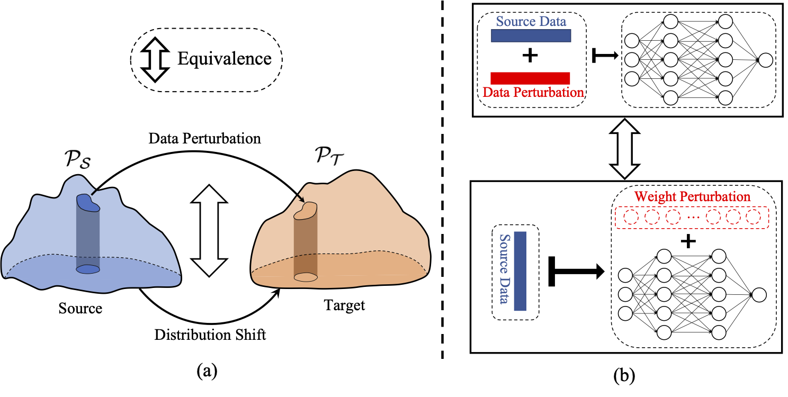

# Chasing Fairness under Distribution Shift: a Model Weight Perturbation Approach

[](https://opensource.org/licenses/MIT)

Codes for [NeurIPS'23] [Chasing Fairness under Distribution Shift: a Model Weight Perturbation Approach](https://openreview.net/forum?id=DVjyq5eCAD&referrer=%5BAuthor%20Console%5D(%2Fgroup%3Fid%3DNeurIPS.cc%2F2023%2FConference%2FAuthors%23your-submissions)).

Zhimeng Jiang*, Xiaotian Han*, Hongye Jin, Guanchu Wang, Rui Chen, Na Zou, Xia Hu

## About This Work

### Reserch Motivation

Machine learning fairness is crucial, especially when data changes or "shifts" between different scenarios (e.g., temporal or spatial distribution shifts). In this paper, we first theoretically demonstrate the **inherent connection between distribution shift,  data perturbation, and model weight perturbation**.
Subsequently, we analyze the **sufficient conditions to guarantee fairness** (i.e., low demographic parity) for the target dataset, including fairness for the source dataset, and low prediction difference between the source and target dataset for each sensitive attribute group. Motivated by these sufficient conditions, we propose robust fairness regularization (RFR) by considering the worst case within the model weight perturbation ball for each sensitive attribute group.

### Rethinking Distribution Shifts Problem
We provide a theoretically understanding on
the relations between distribution shift, data perturbation, and model weight perturbation in the following figure:



### Advantages of RFR
Easy to implement; Does not require prior knowledge (e.g., causual relation) on distribution shift

## Dependency
````angular2html
python >= 3.8.0
torch >= 1.10.2+cu113
torchvision >= 0.12.0+cu113
numpy >= 1.22.3
folktables == 0.0.11
````

## Run this Repo
Train a DNN using RFR for real-world distribution shifts by running the bash commend:
````angular2html
bash shell/run_dnn_rfr_real.sh
````

Train a DNN using RFR for synthetic distribution shifts by running the bash commend:
````angular2html
bash shell/run_dnn_rfr.sh
````

## Acknowledgment

Our code is developed based on the opensource repo of [SAM](https://github.com/google-research/sam).

Thanks those teams for their contribution to the ML community!

## Citation

```
@inproceedings{
jiang2023chasing,
title={Chasing Fairness under Distribution Shift: a Model Weight Perturbation Approach},
author={Jiang, Zhimeng and Han, Xiaotian and Jin, Hongye and Wang, Guanchu and Chen, Rui and Zou, Na and Hu, Xia},
booktitle={Thirty-seventh Conference on Neural Information Processing Systems},
year={2023},
url={https://openreview.net/forum?id=DVjyq5eCAD}
}
```

## License
[MIT](https://choosealicense.com/licenses/mit/)